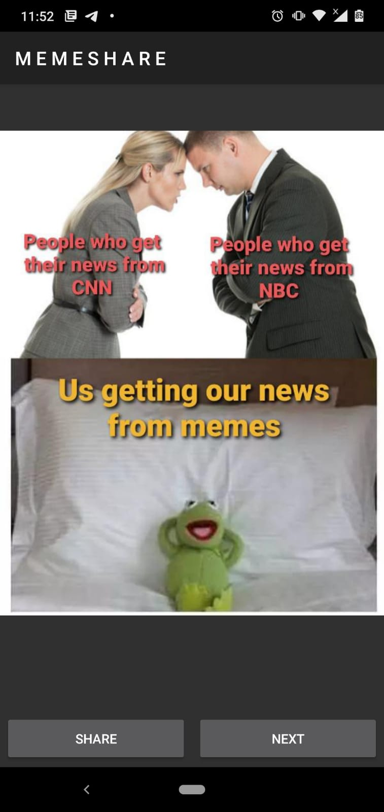

### Meme Share Application

#### Made With:

  &nbsp
  

This is a learning project which I have created for learning about API Calls, ImageView, Intents and Activities in Android.

The language used is Kotlin, along with Volley library for making API calls, and the Glide library for displaying the meme image whose url we get from the API call.

A sample of the UI of the application is shown below:

| Page Name | Image |
| --------- | ----- |
| Home Page |  |

Feel free to fork or star this repo for future reference :smiley: :smiley:
